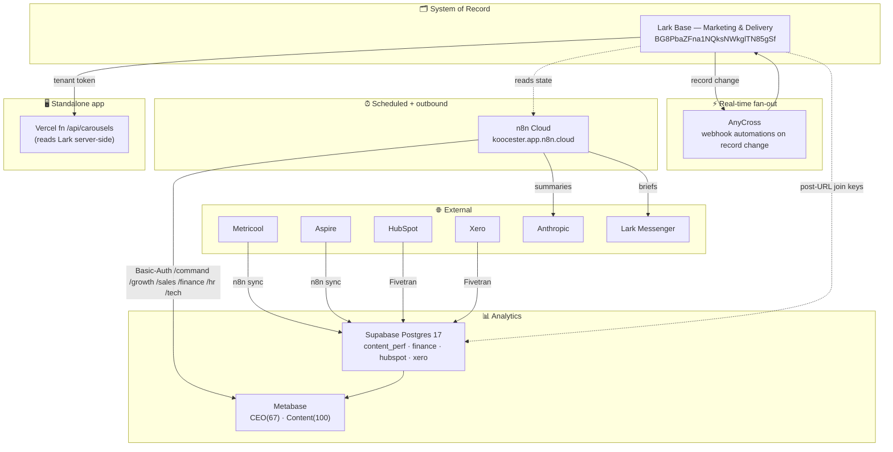

# 05 — Architecture

Four cooperating planes around a single source of truth, plus one standalone app. Seams are webhooks, cron jobs, and Fivetran syncs.

## Data flow (words)
1. Work happens in **Lark**; **AnyCross** reacts in real time.
2. **n8n** compiles briefs (via **Anthropic**) → **Lark Messenger**, syncs **Metricool**/**Aspire** → **Supabase**, and serves the **Command** dashboard.
3. **Fivetran** replicates **HubSpot** + **Xero** → **Supabase**.
4. **Metabase** reads Supabase. The **Vercel** app reads Lark directly (server-side) for the carousel view.

## Component responsibilities
- **Lark Base** — operational truth, stage machine, SLA formulas, role auto-assign.
- **AnyCross** — low-latency automation (assign/notify/calendar/fan-out).
- **n8n Cloud** — the clock and the outbound; the only scheduler.
- **Supabase** — warehouse; fed by Fivetran + n8n; read by Metabase.
- **Metabase** — BI for finance/sales/content.
- **Vercel app** — a focused live dashboard, credentials server-side only.

## Key boundaries
- Operational state → Lark only. Real-time → AnyCross; scheduled → n8n. Analytics → downstream, read-mostly.
- Secrets → managed stores, never inline (current debt: n8n inline secrets).

## Cross-links
- Data-flow diagram: [diagrams/data-flow.mmd](diagrams/data-flow.mmd)
- n8n workflow map: [diagrams/n8n-workflow-map.mmd](diagrams/n8n-workflow-map.mmd)
- Decision record: [adr/ADR-0001-reconstructed-current-architecture.md](adr/ADR-0001-reconstructed-current-architecture.md)
